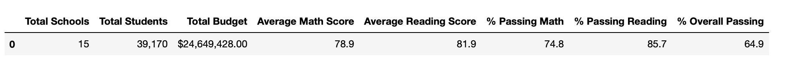

# School District Analysis Challenge
PyCitySchools with Pandas

## Main Objective
1. Open Jupyter Notebook files from local directories using a development environment.
2. Read an external CSV file into a DataFrame.
3. Format a DataFrame column.
4. Determine data types of row values in a DataFrame.
5. Retrieve data from specific columns of a DataFrame.
6. Merge, filter, slice, and sort a DataFrame.
7. Use multiple methods to perform a function on a DataFrame.
8. Perform mathematical calculations on columns of a DataFrame or Series.

## Purpose
A school district asked for a snapshot of several key metrics by each school campus and by the district level.  The main analysis focused on the performance of math and reading scores disaggregated several ways in preparation for a board meeting.  However, after the school board reviewed the data, it was determined that the data from Thomas High School's 9th grade class was suspect of cheating.  The school board asked for the data to be removed and analyzed again for a comparison. 

## PythonData Environment
1. Anaconda version 1.7.2
2. Conda version 4.9.0
3. Jupyter-Notebook version 6.1.4
4. ipykernal version 5.3.4
5. Python version 3.7.7
6. Pandas version 1.1.3
7. Numpy version 1.19.1
8. GitBash version 2.28.0.windows.1

## Process
1. Open Jupyter Notebook files from local directories using a development environment.
2. Read an external CSV file into a DataFrame.
3. Format a DataFrame column.
4. Determine data types of row values in a DataFrame.
5. Retrieve data from specific columns of a DataFrame.
6. Merge, filter, slice, and sort a DataFrame.
7. Apply the groupby() function to a DataFrame.
8. Use multiple methods to perform a function on a DataFrame.
9. Perform mathematical calculations on columns of a DataFrame or Series.

## Results

### How is the district summary affected?
Original Analysis:

The testing data of 461 9th graders at Thomas High School was turned into null data, which recalculated the percentages of passing math, passing reading, and the overall passing.  The total count of students did not change as that was run on the count of the student ids, which was not turned into null data. 

Adjusted Analysis:
![Pic 2](https://github.com/

When comparing the two charts, removing less than 500 test scores had a nominal impact on the almost 40,000 student data set.  The change was less than a 1% difference and the numbers would still round to the same whole number.  

### How is the school summary affected?

In the original analysis, Thomas High School started with a 91% overall passing rate, which was a concern to the school board as being too high.  After calculating the total number of 10th - 12th grade students as the new denominator, the rest of the testing data was adjusted accordingly.  

Original Analysis:
![Pic 3](https://github.com/

Adjusted Analysis:
![Pic 4](https://github.com/

Removing the 9th grade students from the data set had a huge impact by dropping from 91% to 65% for the overall passing rate. 

### How does replacing the ninth graders’ math and reading scores affect Thomas High School’s performance relative to the other schools?
In the original analysis, Thomas High School ranked 2nd in the district raising red flags with the school board. 

Original Analysis:
![Pic 5](https://github.com

After adjusting the 9th grade data, Thomas High School ranked in the exact middle of 15 campuses at 8th from the bottom. 

Adjusted Analysis:
![Pic 6](https://github.com/

## How does replacing the ninth-grade scores affect the following:

### Adjusted Averages using the Math and Reading Scores 

In the original analysis, Thomas High School had 83.6 math average and 83.7 reading average for the 9th grade tests. 
Now the scores have been replaced with null values and shows up in Python programming as NaN in the following charts. 

Adjusted Average Math Scores ----------------------------------------------------- Adjusted Average Reading Scores: 

![Pic 7](https://github.com/
![Pic 8](https://github.com/

### Scores by school spending

Thomas High School falls in the $630-$644/student spending range.  However, the hundredths place was needed to see the nominal changes. 

Original Analysis:
![Pic 9](https://github.com

Adjusted Analysis:
![Pic 10](https://github.com/

There was very little spending impact by changing the 9th grade scores. 

### Scores by school size
Thomas High School is defined as a medium sized school.  The hundredths place was needed to see the nominal changes.

Original Analysis:
![Pic 11](https://github.com/

Adjusted Analysis:
![Pic 12](https://github.com/B

There was very little impact by campus size due to changing the 9th grade scores. 

### Scores by school type

Thomas High School is a charter school type. The hundredths place was needed to see the nominal changes.

Original Analysis:
![Pic 13](https://github.com/

Adjusted Analysis:
![Pic 14](https://github.com/B

There was very little impact by school type by changing the 9th grade scores. 

## Summary: Summarize four major changes in the updated school district analysis after reading and math scores for the ninth grade at Thomas High School have been replaced with NaNs.

1. The overall passing rate for Thomas High School changed dramatically from 91% to 65%. 

2. Thomas High School's ranking dropped from 2nd to 8th in the district of 15 campuses. 

3. Data at the grade level will now show as "NaN" in reports for the 9th grade students at Thomas High School  

4. In addition to the overall passing rate, the campus math and reading averages and passing percentages all saw shifts.  

The major changes will be seen at the lower views of the disaggregated data with minor impact to the larger data views.

